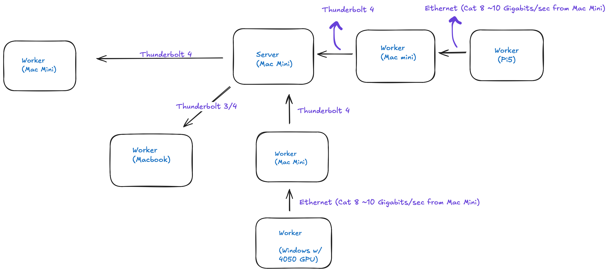

# SmolCluster

A distributed deep learning framework for training neural networks across heterogeneous hardware using PyTorch and socket-based communication.

## Features

- **Distributed Training Algorithms**: Elastic Distributed Parallelism (EDP), Synchronous Parameter Server (SyncPS), and Model Parallelism
- **Heterogeneous Hardware**: Mac minis, Raspberry Pis, MacBooks, and Windows machines
- **Model Support**: MNIST, GPT-2, and custom neural networks
- **Distributed Inference**: Model parallelism with streaming token generation
- **Centralized Logging**: Grafana + Loki for real-time log aggregation
- **Web Interface**: React-based chat UI for GPT inference
- **Experiment Tracking**: W&B integration with automatic metrics logging

## Quick Start

```bash
# Install uv package manager
curl -LsSf https://astral.sh/uv/install.sh | sh

# Clone and install
git clone https://github.com/YuvrajSingh-mist/smolcluster.git
cd smolcluster
uv sync

# Launch training (example)
bash scripts/launch_edp_train_gpt.sh
```

## Cluster Topology



## Documentation

- **[Configuration Guide](docs/configuration.md)** - Cluster and model configuration
- **[Training Guide](docs/training.md)** - Training algorithms and usage
- **[Logging Setup](docs/logging.md)** - Grafana + Loki distributed logging
- **[Cluster Setup](docs/setup_cluster.md)** - Hardware setup and networking
- **[Inference Guide](docs/inference.md)** - Model parallelism inference

## Training Algorithms

### Elastic Distributed Parallelism (EDP)
Asynchronous data parallelism with stale gradient tolerance. Best for heterogeneous clusters.

```bash
bash scripts/launch_edp_train_gpt.sh
```

### Synchronous Parameter Server (SyncPS)
Synchronous data parallelism with barrier coordination. Best for homogeneous clusters.

```bash
bash scripts/launch_syncps_train_gpt.sh
```

### Model Parallelism (MP)
Layer-wise model distribution. Best for large models and inference serving.

```bash
bash scripts/inference/launch_mp_inference.sh
bash scripts/inference/launch_api.sh
```

See [training.md](docs/training.md) for detailed algorithm comparison and usage.

## Monitoring

### Weights & Biases
Real-time experiment tracking at [wandb.ai](https://wandb.ai)
- Training/validation metrics
- Per-layer gradient norms
- Hardware utilization

### Grafana + Loki
Centralized log aggregation at [http://localhost:3000](http://localhost:3000)
- Distributed logs from all nodes
- Real-time log queries
- Error tracking

See [logging.md](docs/logging.md) for setup instructions.

## Project Structure

```
smolcluster/
├── docs/                           # Documentation
│   ├── configuration.md            # Config guide
│   ├── training.md                 # Training guide
│   ├── logging.md                  # Logging setup
│   ├── inference.md                # Inference guide
│   └── setup_cluster.md            # Hardware setup
├── src/smolcluster/
│   ├── algorithms/
│   │   ├── EDP/                    # Elastic Distributed Parallelism
│   │   ├── SynchronousPS/          # Synchronous Parameter Server
│   │   └── ModelParallelism/       # Model Parallelism
│   ├── models/                     # Neural network models
│   ├── utils/                      # Utilities and helpers
│   ├── data/                       # Datasets
│   ├── configs/                    # YAML configurations
│   └── chat/                       # Web inference interface
├── scripts/                        # Launch scripts
├── logging/                        # Grafana + Loki setup
└── pyproject.toml                  # Dependencies
```

## Contributing
Pull requests welcome! Please ensure your code follows the existing style and includes appropriate logging.

## License
MIT